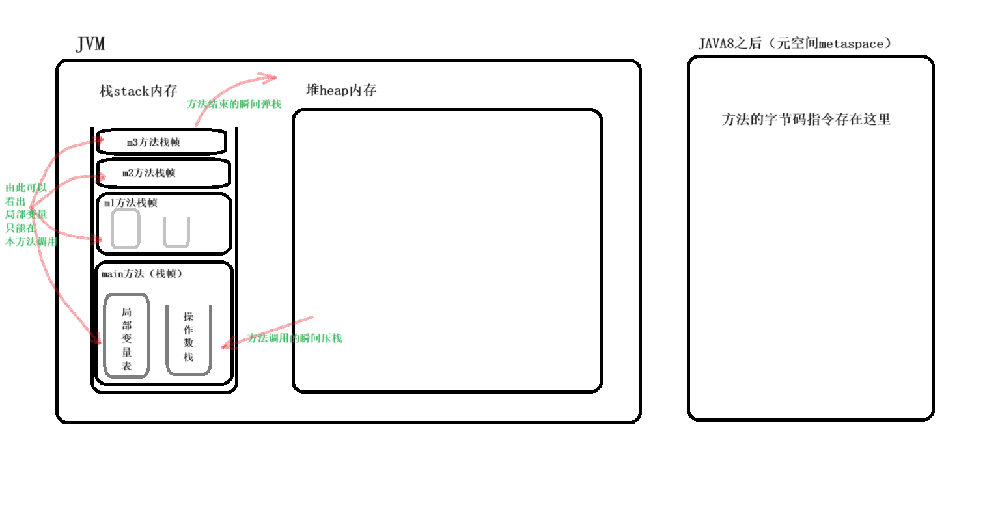

# Method (方法)

## 一、静态方法什么时候需要用类名调用？
调用者和被调用者在同一个类中时，可以省略。

```java
// 调用方法是，类名. 什么情况下可以省略。
public class MethodTest01 {
    public static void main(String[] args) {
        //调用method1
        method1();
        MethodTest01.method1();
        //调用method2
        /*method2(); 编译器报错*/
        MethodTest.method2();
    }
    public static void method1(){
        System.out.println("mothod1执行了！");
    }
}

class  MethodTest{
    public static void method2(){
        System.out.println("method2执行了！");
    }
}
```

## 二、方法语法的小细节

```java
public class MethodTest05 {

    // 缺少返回语句
    public static int m1() {
        int i = 100;
        if (i > 99) {
            return 1; //虽然这里有返回语句，但是有几率不执行if语句。所以编译器不通过。
        }
        
    }
}
```

## 三、方法执行的内存图
>**概念：** Java 的元空间（Metaspace）是 Java 虚拟机（JVM）用来存储类元数据的内存区域。在传统的 Java 虚拟机实现中，类元数据通常存储在永久代（Permanent Generation）中。但是，从 JDK 8 开始，永久代被移除，取而代之的是元空间。
>
>**元空间与永久代相比有几个显著的不同点：**
>* 内存位置： 元空间不是在 Java 虚拟机的堆内存中，而是位于本地内存中。这使得元空间的大小不受堆内存的限制，可以动态地根据应用程序的需要调整大小。
>* 自动调整大小： 元空间的大小可以根据应用程序的需要动态调整，因此不容易出现类加载溢出的情况。在使用元空间时，不需要手动设置元空间的大小，JVM 会根据应用程序的需求自动调整。
>* 内存回收： 元空间的内存是由 JVM 进行管理的，不需要像永久代一样手动进行垃圾回收。当类加载器不再需要某些类的元数据时，JVM 会自动进行回收，而不会出现永久代中的内存泄漏问题。
>* 垃圾收集器： 元空间的垃圾收集与堆内存的垃圾收集不同，通常不会触发 Full GC。类加载器卸载类时，相关的元数据会被及时回收，不会等待垃圾收集器的触发。

```java
/*
1.方法如果只定义，不调用是不会分配内存空间。（从Java8开始，方法的字节码指令存储在元空间metaspace当中。元空间使用的是本地内存。）
2.方法调用的瞬间，会在JVM的栈内存当中分配活动场所，此时发生压栈动作。
3.方法一旦结束，给该方法分配的内存空间就会释放。此时发生弹栈动作。
*/
public class MethodTest02{
    public static void main(String[] args){
        System.out.println("main begin");
        m1();
        System.out.println("main over");
    }

    public static void m1(){
        System.out.println("m1 begin");
        m2();
        System.out.println("m1 over");
    }

    public static void m2(){
        System.out.println("m2 begin");
        m3();
        System.out.println("m2 over");
    }

    public static void m3(){
        System.out.println("m3 begin");
        System.out.println("m3 over");
    }
}
```



## 四、方法重载

### 4.1、在 Java 中，方法重载需要满足以下条件：

1. **方法名称相同：** 重载方法的名称必须相同。
2. **参数列表不同：** 重载方法的参数列表必须不同，可以通过参数的数量、类型或者顺序来区分不同的重载方法。
3. **返回类型可以不同：** 重载方法的返回类型可以相同也可以不同。但是，仅仅通过返回类型的不同是无法实现方法重载的，因为 Java 中不允许仅通过返回类型的不同来区分不同的方法。
4. **访问修饰符、方法体、抛出的异常可以相同也可以不同：** 重载方法的访问修饰符、方法体、以及方法中可能抛出的异常可以相同也可以不同。
5. **方法重载与参数的名称无关：** 方法重载与参数的名称无关，只与参数列表的类型、数量和顺序有关。

### 4.2、方法重载示例代码

```java
/*
方法重载是编译阶段的机制还是运行阶段的机制？
	方法重载机制是编译阶段的机制。
	在编译阶段已经完成了方法的绑定。
	在编译阶段已经确定了要调用哪个方法了。

什么情况下我们考虑使用方法重载呢？
	在以后的开发中，在一个类中，如果两个方法的功能相似，建议将方法名定义为同一个名字。
	此时就使用了方法重载机制。
*/
public class MethodOverloadTest01 {
    public static void main(String[] args){
        m1();
        m1

("abc");

        m2(10, 20);
        m2(10L, 20L);

        m3("x", 10);
        m3(10, "x");
    }

    // 形参的个数不同
    public static void m1(){
        System.out.println("m1()");
    }
    public static void m1(String s){
        System.out.println("m1(String s)");
    }

    // 形参类型不同
    public static void m2(int a, int b){
        System.out.println("m2(int a, int b)");
    }
    public static void m2(long a, long b){
        System.out.println("m2(long a, long b)");
    }

    // 形参顺序不同
    public static void m3(String s, int a){
        System.out.println("m3(String s, int a)");
    }
    public static void m3(int a, String s){
        System.out.println("m3(int a, String s)");
    }

    // 以下这两个方法没有构成方法重载，属于方法重复定义了。语法错误，编译器报错。
	/*
	public static void doSome(int a, int b){
	
	}
	public static void doSome(int x, int y){
	
	}
	*/
}
```

### 4.3、println方法重载源码(部分)

```java
 /* Methods that do not terminate lines */

    /**
     * 打印布尔值。 {@link 生成的字符串
     * java.lang.String#valueOf（boolean）} 被转换为字节
     * 根据平台默认的字符编码，以及这些字节
     * 完全按照
     * {@link #write（int）} 方法。
     *
     * @param b 要打印的 {@code 布尔值}
     */
    public void print(boolean b) {
        write(String.valueOf(b));
    }

   /**
     * 打印字符。 该字符将转换为一个或多个字节
     * 根据给定给构造函数的字符编码，或
     * 平台的默认字符编码（如果未指定）。这些字节
     * 完全按照 {@link #write（int）} 方法的方式编写。
     *
     * @param c 要打印的 {@code 字符}
     */
    public void print(char c) {
        write(String.valueOf(c));
    }

    /**
     * 打印整数。 {@link 生成的字符串
     * java.lang.String#valueOf（int）} 被转换为字节
     * 根据平台默认的字符编码，以及这些字节
     * 完全按照
     * {@link #write（int）} 方法。
     *
     * @param i 要打印的 {@code int}
     * @see java.lang.Integer#toString（int）
     */
    public void print(int i) {
        write(String.valueOf(i));
    }

    /**
     * 打印长整数。 {@link 生成的字符串
     * java.lang.String#valueOf（long）} 被翻译成字节
     * 根据平台默认的字符编码，以及这些字节
     * 完全按照
     * {@link #write（int）} 方法。
     *
     * @param l 要打印的 {@code long}
     * @see java.lang.Long#toString（long）
     */
    public void print(long l) {
        write(String.valueOf(l));
    }

    /**
     * 打印浮点数。 {@link 生成的字符串
     * java.lang.String#valueOf（float）} 被转换为字节
     * 根据平台默认的字符编码，以及这些字节
     * 完全按照
     * {@link #write（int）} 方法。
     *
     * @param f 要打印的 {@code float}
     * @see java.lang.Float#toString（float）
     */
    public void print(float f) {
        write(String.valueOf(f));
    }

    /**
     * 打印双精度浮点数。 生成的字符串
     * {@link java.lang.String#valueOf（double）} 被翻译成
     * 字节根据平台的默认字符编码，这些
     * 字节的写入方式与 {@link
     * #write（int）} 方法。
     *
     * @param d 要打印的 {@code double}
     * @see java.lang.Double#toString（double）
     */
    public void print(double d) {
        write(String.valueOf(d));
    }

    /**
     *打印字符数组。 字符转换为字节
     * 根据给定给构造函数的字符编码，或
     * 平台的默认字符编码（如果未指定）。这些字节
     * 完全按照 {@link #write（int）} 方法的方式编写。
     *
     * @param s 要打印的字符数组
     *
     * @throws NullPointerException 如果 {@code s} 为 {@code null}
     */
    public void print(char s[]) {
        write(s);
    }

    /**
     * 打印字符串。 如果参数为 {@code null}，则字符串
     * {@code “null”} 被打印出来。 否则，字符串的字符为
     * 根据给定的字符编码转换为字节
     * 构造函数，或平台的默认字符编码（如果为否）
     *指定。这些字节的写入方式与
     * {@link #write（int）} 方法。
     *
     * @param s 要打印的 {@code String}
     */
    public void print(String s) {
        write(String.valueOf(s));
    }

    /**
     *打印对象。 由 {@link 生成的字符串
     * java.lang.String#valueOf（Object）} 方法转换为字节
     * 根据平台默认的字符编码，以及这些字节
     * 完全按照
     * {@link #write（int）} 方法。
     *
     * @param obj 要打印的 {@code 对象}
     * @see java.lang.Object#toString（）
     */
    public void print(Object obj) {
        write(String.valueOf(obj));
    }
```

## 五、方法的递归调用

### 5.1、概念

方法的递归调用是指在方法的执行过程中直接或间接地调用自己。
递归是一种常用的编程技术，特别适用于解决可以被分解为相同问题的子问题的情况，例如树的遍历、阶乘计算、斐波那契数列等。

### 5.2、在使用递归调用时，需要注意以下几点

**1、递归终止条件：** 在递归方法中，<u>必须包含递归终止条件，以避免无限递归调用，导致栈溢出。</u>递归调用如果没有结束条件的话，会出现栈内存溢出错误： java.lang.StackOverflowError    
**2、递归调用栈**： 每次进行递归调用时，都会在调用栈上创建一个新的方法调用帧。因此，递归调用的层数不能太深，否则可能导致栈溢出错误。     
**3、性能考虑：** 递归调用可能会导致性能下降，因为每次递归调用都会涉及方法调用、栈帧的创建和销毁等操作。在某些情况下，使用迭代或其他方法可能更有效。    
**4、空间复杂度：** 递归调用的空间复杂度通常较高，因为需要在调用栈上保存每次方法调用的状态。在设计递归算法时，应该考虑到这一点。    
**5、测试和调试：** 递归调用的测试和调试可能比较困难，因为需要考虑递归的深度和复杂度。可以使用断点调试、打印调试信息等方法来帮助理解和调试递归算法。

>在实际开发中，如果因为递归调用发生了栈内存溢出错误，该怎么办？
>首先可以调整栈内存的大小。扩大栈内存。
>如果扩大之后，运行一段时间还是出现了栈内存溢出错误。
>可能是因为递归结束条件不对。需要进行代码的修改。

```java

public class MethodRecursionTest01{

    public static void main(String[] args){
        int n = 5;
        int result = jieCheng(n);
        System.out.println("result = " + result);
    }

    public static int jieCheng(int n){
        if(n == 1){
            return 1;
        }
        return n * jieCheng(n - 1);
    }
}
```

