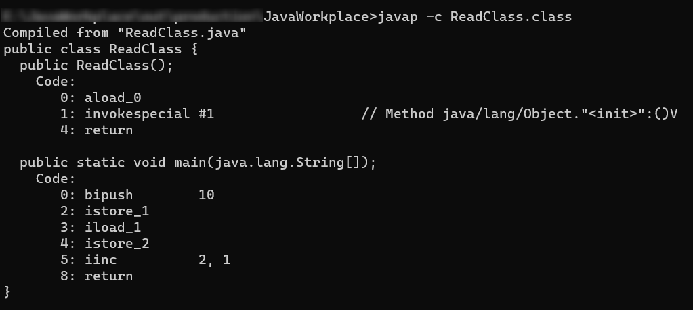
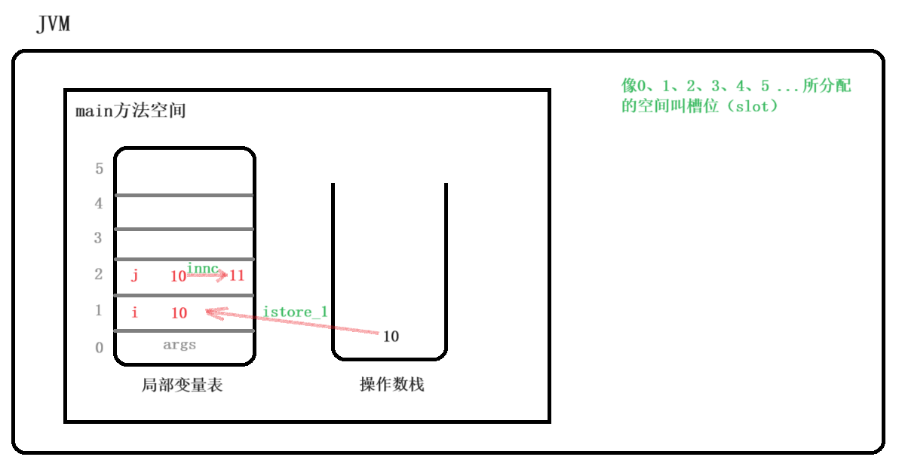

# 字节码解读

## 一、基础概念

1. Windows cmd 查看程序字节码指令：`javap -c`
2. 局部变量表、操作数栈、槽位
    - 在 Java 语言中，任何一个方法执行时，都会专门为这个方法分配所属的内存空间，供这个方法的使用。
    - 每个方法都有自己独立的内存空间，这个内存空间有两块比较重要的内存空间：**局部变量表、操作数栈**
    - 此外，**局部变量表中还管理着槽位**，<u>在 Java 虚拟机的线程栈中，局部变量、操作数栈和返回值等数据存储在称为“**槽位**”的内存单元中。</u>
    - 每个槽位通常可以容纳一个基本类型值或者是一个引用。
3. `bipush`、`istore`、`iload`、`iinc`
    - `bipush` 是 Java 虚拟机（JVM）中的一个字节码指令，用于将一个字节（byte）常量推送到操作数栈顶。
    - `istore` 是 Java 虚拟机（JVM）中的一个字节码指令，用于将整数类型的值从操作数栈顶存储到局部变量表中的指定位置。
    - `iload` 是 Java 虚拟机（JVM）中的一个字节码指令，用于将整数类型的值从局部变量表中加载到操作数栈顶。
    - `iinc` 是 Java 虚拟机（JVM）中的一个字节码指令，用于对局部变量表中的整数值进行增量操作。

## 二、引例

### 2.1、局部变量表、操作数栈、槽位、字节码解读（详细）

- **源码：**

```java
public class ReadClass {
    public static void main(String[] args) {
        int i=10;
        int j=i;
        j++;
    }
}
```

- **字节码：**

```java
Compiled from "ReadClass.java"
public class ReadClass {
    public ReadClass();
    Code:
            0: aload_0
            1: invokespecial #1                  // Method java/lang/Object."<init>":()V
            4: return

    public static void main(java.lang.String[]);
    Code:
            0: bipush        10
            2: istore_1
            3: iload_1
            4: istore_2
            5: iinc          2, 1
            8: return
}
```



- **解读：**
    - `bipush 10`: 将 10 这个字面量压入操作数栈中。
    - `istore_1`: 将操作数栈顶元素弹出，然后将其存储到局部变量表的一号槽位上。
    - `iload_1`: 将局部变量表 1 号槽位上的数据复制一份，压入操作数栈。
    - `istore_2`: 将操作数栈顶元素弹出，然后将其存储到局部变量表的二号槽位上。
    - `iinc 2, 1`: 将局部变量表的 2 号槽位上的数加一。



### 2.2、i++、++i 字节码角度剖析

- **i++ 源码：**

```java
public class ReadClass1 {
    public static void main(String[] args) {
        int i=10;
        int j=i++;  //先引用 i 的值，后执行自增操作。
    }
}
```

- **i++ 字节码：**

```java
Compiled from "ReadClass1.java"
public class ReadClass1 {
    public ReadClass1();
    Code:
            0: aload_0
            1: invokespecial #1                  // Method java/lang/Object."<init>":()V
            4: return

    public static void main(java.lang.String[]);
    Code:
            0: bipush        10     // 向操作数栈压入 10。
            2: istore_1             // 将操作数栈顶元素弹出，然后将其存储到局部变量表的 1 号槽位上。
            3: iload_1              // 将局部变量表 1 号槽位上的数据复制一份，压入操作数栈。压入的是                                                                                           10。
            4: iinc          1, 1   // 将局部变量表的 1 号槽位上的数加一。  
            7: istore_2             // 将操作数栈顶元素弹出，然后将其存储到局部变量表的 2 号槽位上。
            8: return
```

- **++i 源码：**

```java
public class ReadClass2 {
    public static void main(String[] args) {
        int i=10;
        int j=++i;   // 先执行自增操作，后引用 i 的值。
    }
}
```

- **++i 字节码：**

```java
Compiled from "ReadClass2.java"
public class ReadClass2 {
    public ReadClass2();
    Code:
            0: aload_0
            1: invokespecial #1                  // Method java/lang/Object."<init>":()V
            4: return

    public static void main(java.lang.String[]);
    Code:
            0: bipush        10      // 向操作数栈压入 10。
            2: istore_1              // 将操作数栈顶元素弹出，然后将其存储到局部变量表的 1 号槽位上。
            3: iinc          1, 1    // 将局部变量表的 1 号槽位上的数加一。 此时一号槽位上的数是 11。
            6: iload_1               // 将局部变量表 1 号槽位上的数据复制一份，压入操作数栈。压入的                                                                                          11。                     
            7: istore_2              // 将操作数栈顶元素弹出，然后将其存储到局部变量表的 2 号槽位上。
            8: return
```
