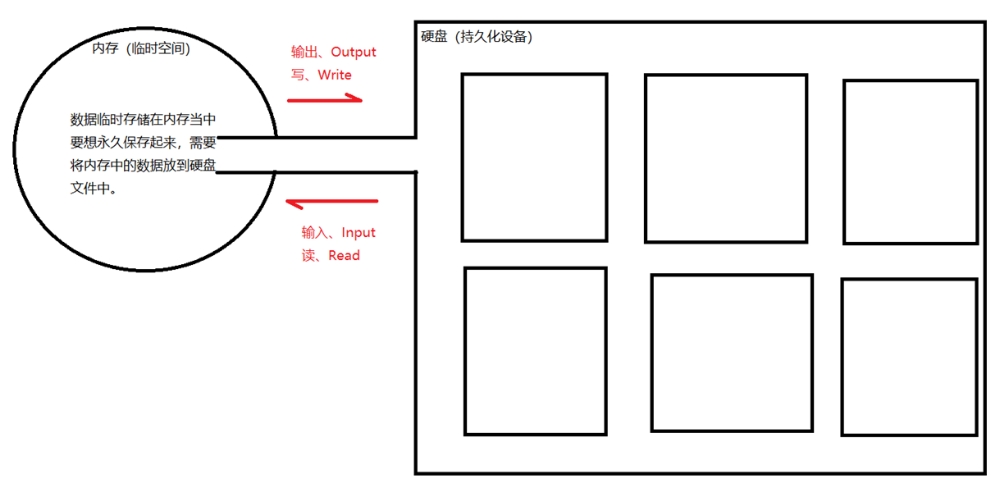

# IO流概述
Java中已经将io流实现了，在java.io包下，可以直接使用。

## 一、什么是IO流？
水分子的移动形成了水流。
IO流指的是：程序中数据的流动。数据可以从内存流动到硬盘，也可以从硬盘流动到内存。   
Java中IO流最基本的作用是：完成文件的读和写。   

## 二、IO流的分类？

### 2.1 根据数据流向分为：输入和输出是相对于内存而言的。
1. 输入流：从硬盘到内存。(输入又叫做读：read)
2. 输出流：从内存到硬盘。（输出又叫做写：write）

### 2.2 根据读写数据形式分为：
1. 字节流：一次读取一个字节。适合读取非文本数据。例如图片、声音、视频等文件。（当然字节流是万能的。什么都可以读和写。）
2. 字符流：一次读取一个字符。只适合读取普通文本。不适合读取二进制文件。因为字符流统一使用Unicode编码，可以避免出现编码混乱的问题。
>注意：Java的所有IO流中凡是以Stream结尾的都是字节流。凡是以Reader和Writer结尾的都是字符流。

### 2.3 根据流在IO操作中的作用和实现方式来分类:
1. 节点流：节点流负责数据源和数据目的地的连接，是IO中最基本的组成部分。
2. 处理流：处理流对节点流进行装饰/包装，提供更多高级处理操作，方便用户进行数据处理。

